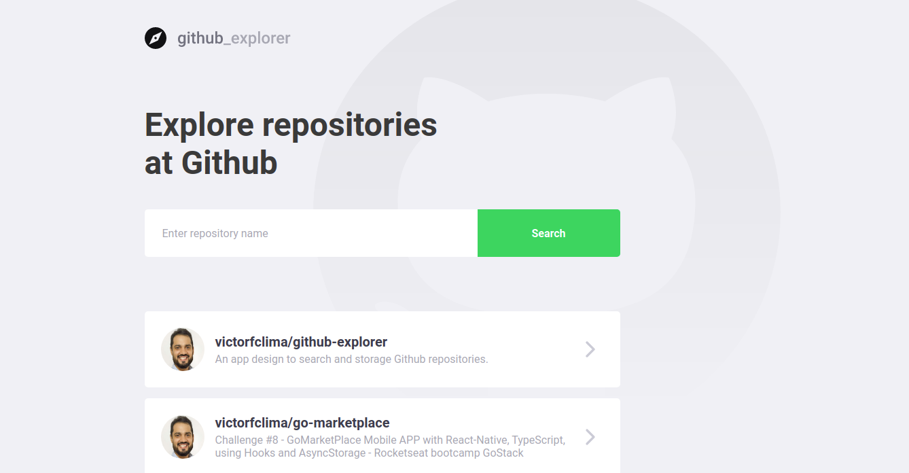
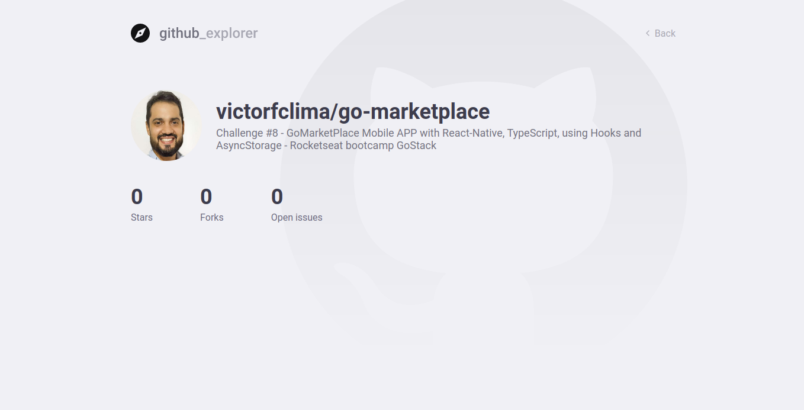

<h1 align="center">Github Explorer - Rocketseat bootcamp GoStack</h1>

<h2>:computer: About</h2>
The purpose of this project is to search, add and show detail info of a Github Api repository<br>

---


<br>


---

<h2>:computer: What is supposed to do?</h2>
<ul>
<li>Search into Github API for repositories</li>
<li>Add the repository on Local Storage</li>
<li>Show details about this repository</li>
</ul>

---

<h2>:toolbox: What did I use?</h2>

- [React](https://reactjs.org/)
- [Axios](https://github.com/axios/axios/)
- [TypeScript](https://www.typescriptlang.org/)

---

<h2>:heavy_check_mark: Check the project</h2>

#### Running the project
```bash
# Step 1 (clone the repository):

$ git clone https://github.com/victorfclima/github-explorer.git

# Step 2 (install the dependencies):

$ yarn

# Step 3 (Initialize web app):

$ yarn start
```
